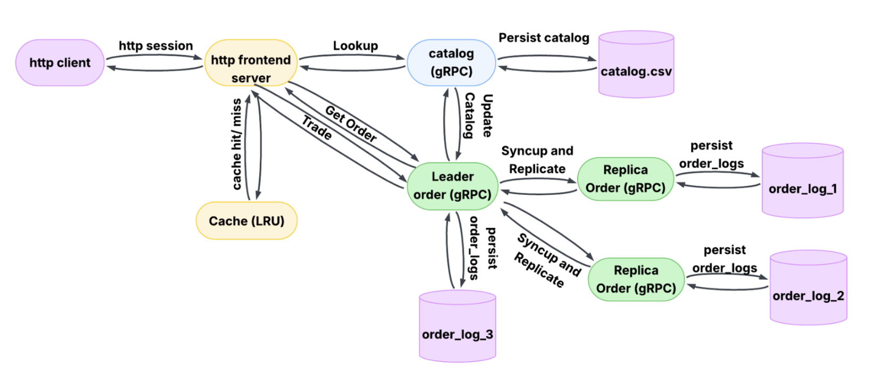

In this lab, we design a distributed, multi-tier stock trading server capable of handling high volumes
of concurrent lookup and trade operations. The system is decomposed into three microservices:
front-end, catalog, and order. We enhance our system by introducing caching, replication, and
fault tolerance. The goal is to achieve improved latency, availability, and robustness under failures.
- An LRU cache at the front-end.
- Replicated order services with a leader-follower protocol.
- Automatic failover and state synchronization for crash recovery.

## Architecture 




Our system consists of the following microservices, all launched on a t2.medium EC2 instance using
Bash scripts. Services are started using native_build.sh and failure scenarios are simulated using
simulate_crashes.sh.

- Front-end Service
  - Exposes REST APIs and manages session persistence, caching, and failover logic of Leader Order Service triggering leader re-election.
- Catalog Service
  - Maintains an in-memory dictionary of stock data initialized from catalog.csv. Responds to
  lookup and trade requests received via gRPC. Upon trade, updates the stock state and sends
  cache invalidation requests to the front-end. Periodically writes the updated stock data to disk
  using a background thread.
- Order Service (Replicated)
  - Runs 3 replicas, each on a unique port. The replica with the highest available ID is selected
  as leader. The leader processes all trade and order requests, generates a transaction
  number, and propagates the transaction to follower replicas. Followers store the replicated
  data and synchronize any missed transactions on restart using the SyncUp mechanism. Each
  replica writes its order log to disk asynchronously.


## APIs/Interface

Frontend (REST APIs)

- GET /stocks/<stock_name>: Returns stock info (from cache or from catalog)
  - Input: GET /stocks/GameStart
  - Output (Success): { "data": { "name": "GameStart", "price": 15.99, "quantity": 100 } }
  - Output (Error): { "error": { "code": 404, "message": "error message" } }
- GET /orders/<transaction_number>: Retrieves transaction details from the Order leader.
  - Input: GET /orders/42
  - Output (Success): { "data": { "order_num": 42, "name": "GameStart", "type": "buy", "quantity": 1 } }
  - Output (Error): { "error": { "code": 404, "message": "Transaction number not found" } }
- POST /orders: Handles trade requests sent by clients and forwards it to the Order leader replica.
  - Input: POST /orders, Body: { "name": "GameStart", "quantity": 1, "type": "sell" }
  - Output (Success): { "data": { "transaction_number": 42 } }
  - Output (Error): { "error": { "code": 404, "message": "error message" } }
- DELETE /delete/ : Used by Catalog service to remove a stock from cache.
  - Input: DELETE /delete/GameStart
  - Output: { "code": 200, "message": "Cache invalidated" }
  
Implementation Details
- Thread-per-session model with persistent HTTP/1.1 sockets
- Uses OrderedDict to implement LRU caching
- Automatically retries trade or order lookup in case of replica failure after re-electing leader
- Leader elected via gRPC Heartbeat check
- Libraries Used: http.server, socketserver, json, grpc, grpcio-tools, readerwriterlock, os
  
Catalog (gRPC APIs)
- Lookup: Handles stock lookup requests from the frontend and returns price and quantity details.
  - Input: LookupRequest { string stock_name = 1; }
  - Output (Success): LookupResponse { code: 200, name: "GameStart", price: 15.99, quantity: 100 }
  - Output (Error): LookupResponse { code: 404, message: "stock not found" }
- Trade: Handles buy/sell trade requests from order and updates stock quantity and volume.
  - Input: TradeRequest { name: "GameStart", number_of_items: 1, type: "sell" }
  - Output (Success): TradeResponse { code: 200 }
  - Output (Error); TradeResponse { code: 404 }
    
Implementation Details
- In-memory stock dictionary initialized from catalog.csv
- Background thread writes updated stock data to disk every second
- After successful trade, sends HTTP DELETE to frontend to invalidate cached stock
- Thread safety enforced using fair read-write locks (RWLockFair)
- Libraries Used: grpc, concurrent.futures, csv, threading, readerwriterlock, os, requests

Order (gRPC APIs)
- Order: Validates and processes trade requests. Leader propagates transactions to follower replicas.
  - Input: OrderRequest { name: "GameStart", number_of_items: 1, type: "buy" }
  - Output (Success): OrderResponse { code: 200, transaction_num: 42, message: "order placed successfully" }
  - Output (Error): OrderResponse { code: 404, message: "invalid transaction type/invalid stock name/num stocks traded should be non negative/not enough stocks left to buy" }
- GetOrderDetails: Returns details for a specific transaction number.
  - Input: GetOrderDetailsRequest { transaction_num: 42 }
  - Output (Success): GetOrderDetailsResponse { code: 200, transaction_num: 42, name: "GameStart", type: "buy", volume_traded: 1 }
  - Output (Error): GetOrderDetailsResponse { code: 404, message: "Transaction number not found" }
- Heartbeat: Used by the frontend to detect if an Order replica is alive.
  - Input: Empty {}
  - Output: HeartbeatResponse { code: 200 }
- NotifyReplica: Notifies a replica about the new elected leader.
  - Input: NotifyReplicaRequest { leader_id: 3 }
- ReplicateOrder: Used by the leader to replicate the trade to followers.
  - Input: ReplicateOrderRequest { transaction_num: 42, name: "GameStart", number_of_items: 1, type: "buy", leader_id: 3 }
- SyncUp: Used by crashed replicas to synchronize missed transactions after restart.
  - Input: SyncUpRequest { transaction_num: 37, service_id: 2 }
  - Output: SyncUpResponse { orders: [ OrderDetails { ... }, ... ] }
    
Implementation Details
- Three replicas run independently; leader processes and propagates trades
- Transaction numbers initialized from local CSV logs
- Followers synchronize missed logs after restart using SyncUp
- Background thread periodically writes in-memory logs to disk
- Fair read-write locks protect shared state (RWLockFair)
- Libraries Used: grpc, concurrent.futures, csv, threading, readerwriterlock, os, dotenv


## Step 1: After Cloning

```bash
cd <repository_root>
```

## Step 3: Create a Virtual Environment 

```bash
python3 -m venv .venv
source .venv/bin/activate
pip install -r requirements.txt
```
## Step 4: Start servers (Natively)
Note: For deploying and running server on AWS check the evaluation doc for instructions
```bash
cd src
chmod +x native_build.sh
./native_build.sh
```

## Step 5: Run Client

Inside the Activated previously created virtual environment in a new tab. The frontend HOST may need to be changed depending on where the server is running if native "localhost" if AWS then the public IP of the frontend HOST 

```bash
cd src/client
python http_client.py
```

## Step 6: To Simulate Crash Failures

```bash
cd src
chmod +x simulate_crashes.sh
./simulate_crashes.sh <replica_id (1|2|3)>
```

## Step 8: Test

From the src folder run  
```
pytest
```
This will run the file test_functional.py

To run the load test from the src/test folder run 
```
python load_testing.py
```

